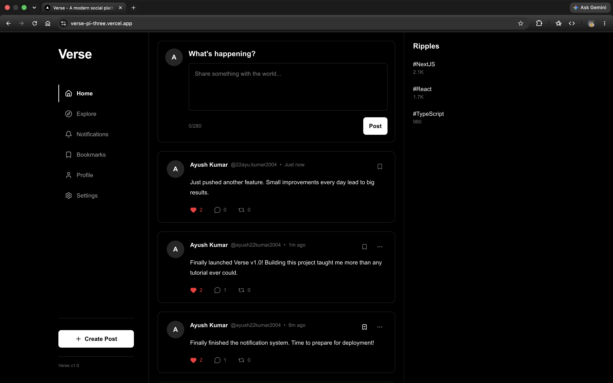
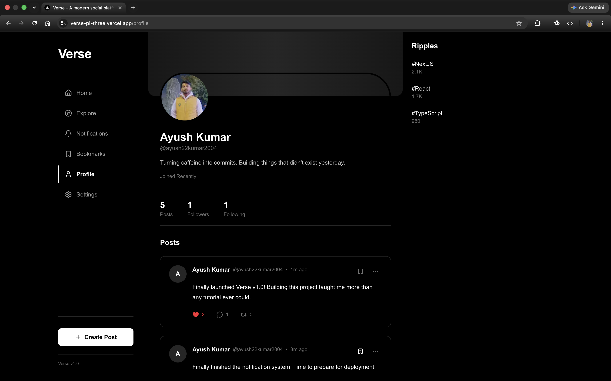
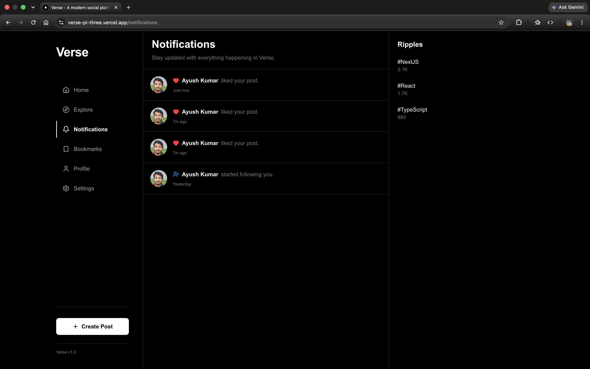

<div align="center">

# Verse

### Designed for connection. Engineered for scale.

A modern social platform built with **Next.js**, **React**, **TypeScript**, **Firebase Authentication**, and **Cloud Firestore**.

Designed with scalability, clean architecture, and reusable components in mind.

---

</div>

## Why Verse?

Most social media clones stop at displaying posts on a screen.

Verse was built differently.

The goal was to understand how modern social applications actually work behind the scenes—authentication, database design, user relationships, reusable architecture, optimistic UI, and production-ready engineering practices.

Instead of focusing only on visuals, Verse focuses on building features the same way a real-world product would.

---

# Features

## Authentication

- Google Sign-In with Firebase Authentication
- Automatic account creation
- Persistent login sessions
- Secure sign out

---

## User Profiles

- Dynamic profile pages
- User information stored in Firestore
- Profile statistics
- Follow / Unfollow users
- Responsive profile layouts

---

## Feed

- Create posts
- Edit posts
- Delete posts
- Real-time post rendering
- Relative timestamps
- Empty state handling

---

## Social Features

- Like posts
- Bookmark posts
- Comment system
- Follow system
- Notification system

---

## Notifications

Users receive notifications for:

- New followers
- Likes
- Comments

Additional features include:

- Unread badge
- Read status updates
- Timestamp tracking

---

## User Experience

- Loading screens
- Error boundaries
- Custom 404 page
- Responsive layout
- Reusable UI components
- Smooth navigation

---

# Tech Stack

| Category | Technology |
|-----------|------------|
| Framework | Next.js 16 |
| Language | TypeScript |
| UI Library | React 19 |
| Styling | Tailwind CSS v4 |
| Authentication | Firebase Authentication |
| Database | Cloud Firestore |
| Icons | Lucide React |
| State Management | React Context API |

---

# Architecture

```
                 Client

              Next.js App
                    │
     ┌──────────────┼──────────────┐
     │              │              │
 Authentication   Firestore     Context API
     │              │              │
     └──────────────┼──────────────┘
                    │
             Service Layer
                    │
          Reusable Components
                    │
              Application UI
```

The application separates UI components from business logic through a dedicated service layer, making features easier to maintain and extend.

---

# Project Structure

```
verse/

├── app/
│   ├── (auth)
│   ├── (main)
│   ├── loading.tsx
│   ├── error.tsx
│   └── not-found.tsx
│
├── components/
│   ├── layout/
│   ├── post/
│   ├── profile/
│   ├── settings/
│   └── ui/
│
├── context/
│
├── hooks/
│
├── lib/
│   ├── firebase/
│   ├── mappers/
│   ├── services/
│   └── utils/
│
├── public/
│
└── README.md
```

---

# Engineering Decisions

Instead of placing Firebase calls directly inside React components, Verse uses a dedicated service layer.

Benefits include:

- Cleaner components
- Better separation of concerns
- Easier testing
- Reusable database logic
- Improved scalability

The UI focuses only on rendering data, while services handle database interactions.

---

# What I Learned

Developing Verse provided hands-on experience with:

- Next.js App Router
- React Hooks
- TypeScript
- Firebase Authentication
- Cloud Firestore
- CRUD Operations
- Database relationships
- Component architecture
- State management
- Error handling
- Production optimization
- Clean project organization
# Getting Started

## Prerequisites

Before running Verse locally, ensure you have the following installed:

- Node.js (v20 or later)
- npm
- A Firebase project with Authentication and Firestore enabled

---

## Installation

Clone the repository

```bash
git clone https://github.com/YOUR_USERNAME/verse.git
```

Navigate into the project

```bash
cd verse
```

Install dependencies

```bash
npm install
```

Create a local environment file

```bash
touch .env.local
```

Add your Firebase configuration

```env
NEXT_PUBLIC_FIREBASE_API_KEY=
NEXT_PUBLIC_FIREBASE_AUTH_DOMAIN=
NEXT_PUBLIC_FIREBASE_PROJECT_ID=
NEXT_PUBLIC_FIREBASE_STORAGE_BUCKET=
NEXT_PUBLIC_FIREBASE_MESSAGING_SENDER_ID=
NEXT_PUBLIC_FIREBASE_APP_ID=
```

Start the development server

```bash
npm run dev
```

Open your browser and visit

```
http://localhost:3000
```

---

# Production Build

Verify the application before deployment.

```bash
npm run lint
```

```bash
npm run build
```

If both commands complete successfully, the project is ready for production.

---

# Screenshots

# Screenshots

> Screenshots will be added after the first production deployment.

## Home Feed

The main feed showcases the core functionality of Verse in a single view, including post creation, likes, comments, bookmarks, relative timestamps, trending topics, and the overall social experience.



---

## User Profile

View user information, profile statistics, followers, following, and all posts published by a user through a dedicated profile page.



---

## Notifications

Stay updated with real-time follow, like, and comment notifications, complete with unread indicators and automatic read status management.



---

# Key Highlights

Unlike many beginner social media projects, Verse includes:

- Complete Firebase Authentication
- Firestore-powered data management
- Dynamic user profiles
- Follow system
- Like system
- Bookmark system
- Comment system
- Notification system
- Reusable service architecture
- Custom loading UI
- Custom error handling
- Custom 404 page
- Production-ready project structure

Every feature was built with maintainability and scalability in mind instead of relying on static mock data.

---

# Challenges Solved

During development, several engineering challenges were addressed, including:

- Designing reusable Firestore service functions
- Managing authentication state across the application
- Handling user relationships such as follows and followers
- Preventing duplicate likes and bookmarks
- Implementing notification workflows
- Organizing a scalable folder structure
- Refactoring mock data into a database-driven architecture
- Preparing the application for production deployment

Each challenge improved the overall quality and maintainability of the project.

---

# Future Improvements

Although Verse v1.0 is feature complete, several enhancements are planned for future versions.

- Direct messaging
- Image uploads using Firebase Storage
- Search functionality
- User profile customization
- Infinite scrolling
- Trending posts algorithm
- Dark mode
- Account settings improvements
- Mobile-first UI refinements
- Performance optimizations

---

# Performance Considerations

The project emphasizes maintainable architecture and efficient rendering.

Current optimizations include:

- Reusable service layer
- Component-based architecture
- Dynamic routing
- Firestore document organization
- Relative timestamp rendering
- Optimized production build
- Clean dependency management

---

# Development Journey

Verse was developed incrementally, with each phase focusing on a specific aspect of the application.

Project milestones included:

- Application architecture
- Authentication
- Firestore integration
- Feed implementation
- Social interactions
- Notifications
- Production cleanup
- Deployment preparation

The complete development process is documented in **dev-log.md**.

---

# Contributing

Contributions, ideas, and suggestions are always welcome.

If you discover a bug or have an improvement in mind, feel free to open an issue or submit a pull request.

---

# License

This project is licensed under the MIT License.

---

# Author

**Ayush Kumar**

Computer Science & Engineering (Data Science)

Passionate about building scalable web applications, solving real-world problems, and exploring modern software engineering practices.

GitHub:
https://github.com/Ayushkumar20045

---

<div align="center">

### Built with Next.js, TypeScript, Firebase and lots of curiosity.

If you found this project interesting, consider giving it a ⭐.

</div>